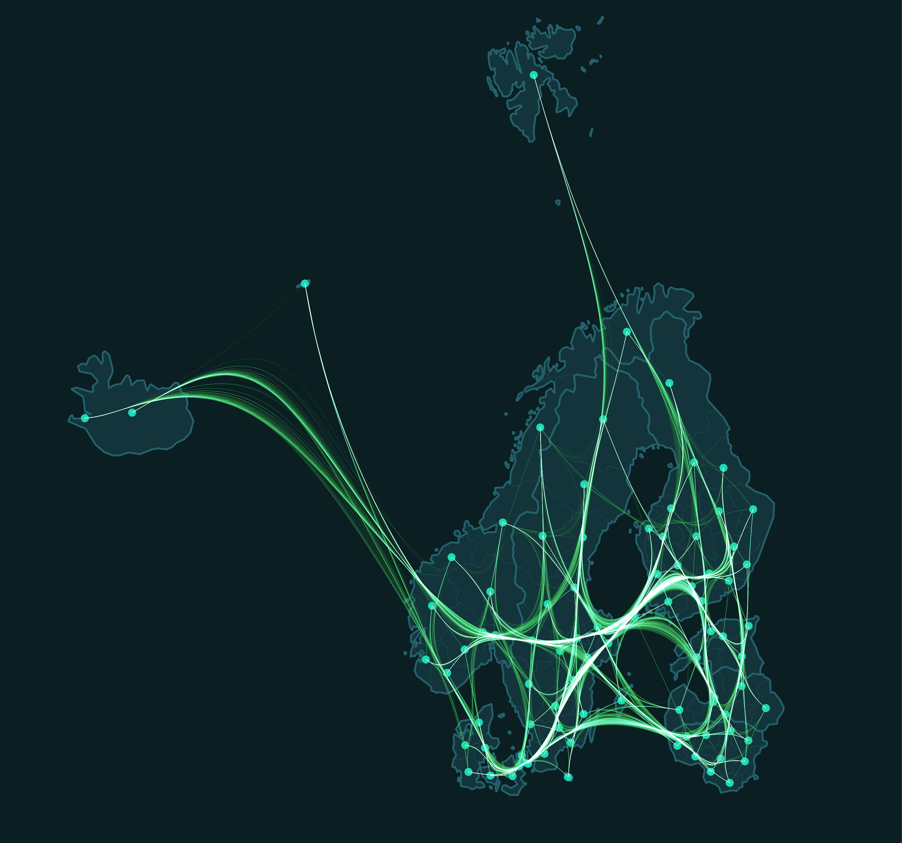

# Edge-bundling tool for regional mobility flow data
This repository hosts the scripts to perform edge-path bundling (Wallinger et al. 2022) for flow data. It's primary use case is to support visualization of complex mobility data, and has been used to bundle human mobility flows across NUTS regions in Europe.

The tool's inputs are two CSV files, one for point feature data and associated coordinates, and another for flows (edges) to be bundled. After bundling, the tool outputs a GeoPackage file. The script expects the data to be in WGS84 coordinate reference system.

The scripts in this repo are repurposed versions of the original scripts written by Peterka (2023). The updates to the original code aim to make the code more usable for analytical purposes.

See image below for an illustration of bundled flows across NUTS 3 regions in Northern Europe.

<p align="center">

</p>

This tool is an additional output of the Mobi-Twin research project.

## Requirements

The scripts within the repo require Python 3.10 or newer version with the following packages:

1. `pandas`
2. `geopandas`
3. `tqdm`
4. `shapely`

On top of these Python requirements, the script expects the input CSV data (centroids and edges) to have a certain structure.

## Data structure for input files

#### Centroid file

| ID_COLUMN | X | Y |
| ---- | :----- | :---------- |
| Unique identifier for centroid (e.g., NUTS code) | X coordinate (WGS84) of the centroid | Y coordinate (WGS84) of the centroid |

N.B.: The `ID_COLUMN` in the above is an example name, use the column name you have in your data.

#### Edge file

| ORIGIN | DESTINATION | OD_ID | COUNT |
| ---- | :----- | :---------- | :---------- |
| ID code of origin | ID code of destination | ID made of origin and destination codes joined by an underscore (_) | Integer/floating point number of flow strength |

N.B.: The ID codes of origins and destinations have to match the IDs of your centroid file.

## Usage

Clone this repository, and run the tool by typing in the following command:

```
python bundle_edges.py -c /path/to/centroids.csv -id ID_COLUMN -ew /path/to/edges.csv -o /path/to/output.gpkg
```

If you want to adjust some parameters of the bundling, such as weights or bundling threshold use the flags `-ew` for edge weights (default is 2), and `-t` for bundling threshold (default is 2). The edge weights dictate how powerful the "gravity" of long edges are. The bundling threshold sets the distance limit for how many times longer the bundled edges can be compared to straight line distances, flows that are longer than the threshold are not bundled but remain as straight line geometries in the output.

Please note, the script expects the coordinates to be in WGS84 [(EPSG:4326)](https://epsg.io/4326)

## References
Wallinger, M., Archambault, D., Auber, D., Nöllenburg, M., & Peltonen, J. (2022). Edge-Path Bundling: A Less Ambiguous Edge Bundling Approach. IEEE Transactions on Visualization and Computer Graphics, 28(1), 313–323. https://doi.org/10.1109/TVCG.2021.3114795

Peterka, O. (2024). Xpeterk1/edge-path-bundling. https://github.com/xpeterk1/edge-path-bundling (Original work published 2023).

## Citing this work

```
@asoftware{Vaisanen2024,
  title = {Edge bundling tool for regional mobility flow data},
  author = {Väisänen, Tuomas and Inkeröinen, Oula and Malekzadeh, Milad and Järv, Olle},
  year = {2024},
  address = {Helsinki, Finland},
  doi = {10.5281/ZENODO.xxxxxxxx},
  urldate = {2024-29-10},
  howpublished = {Zenodo}
}
```
## Related links

* [Mobi-Twin project official webpage](https://mobi-twin-project.eu/)
* [Digital Geography Lab webpage](https://www.helsinki.fi/en/researchgroups/digital-geography-lab)