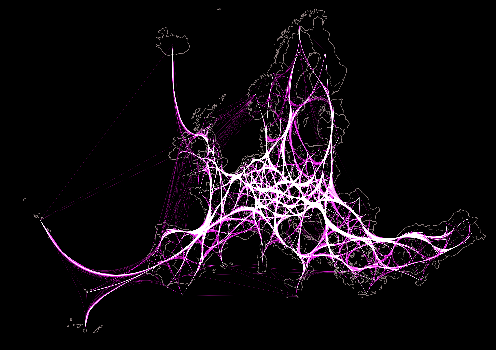

# Edge-bundled NUTS 2 OD flows & edge-bundling tool
Repository hosting the scripts and edge-bundled flows between NUTS 2 regions. The scripts in this repo are repurposed versions of the original scripts written by Peterka (2023), which uses the edge-path bundling approach developed by Wallinger et al., (2022).



## Description of edge-bundled data

This repository contains scripts for generating a `geopackage` file of edge-bundled line geometries between all NUTS 2 regions in Europe. The starting and ending points of the lines are the centroids of the NUTS 2 regions using the 2021 version of the regions. The edge-bundled base network data was produced in three steps:

1. We generate the centroids for all NUTS 2 regions using the 2021 version of NUTS 2 regions.
2. We generate line geometries from all centroids of NUTS2 regions to all other centroids of NUTS 2 regions.
3. We performed edge bundling using a specific technique, edge-path bundling, developed by Wallinger et al. (2022) and implemented into Python by Peterka (2024). This technique bundles the edges using weighted shortest paths to reduce its deviation from a straight line while accounting for directionality.

## References
Wallinger, M., Archambault, D., Auber, D., Nöllenburg, M., & Peltonen, J. (2022). Edge-Path Bundling: A Less Ambiguous Edge Bundling Approach. IEEE Transactions on Visualization and Computer Graphics, 28(1), 313–323. https://doi.org/10.1109/TVCG.2021.3114795

Peterka, O. (2024). Xpeterk1/edge-path-bundling. https://github.com/xpeterk1/edge-path-bundling (Original work published 2023).

## Citation

```
@asoftware{Vaisanen2024,
  title = {Edge-bundled geometries between centroids of NUTS 2 2021 regions},
  author = {Väisänen, Tuomas and Inkeröinen, Oula and Malekzadeh, Milad and Järv, Olle},
  year = {2024},
  address = {Helsinki, Finland},
  doi = {10.5281/ZENODO.xxxxxxxx},
  urldate = {2024-29-10},
  howpublished = {Zenodo}
}
```
